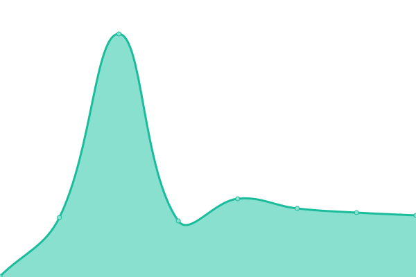
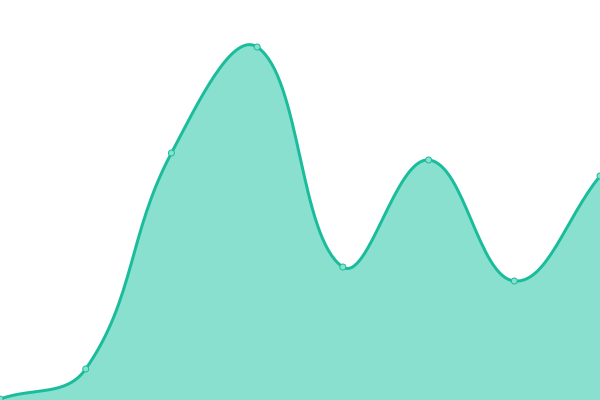
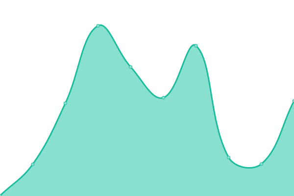

# [


Monitor Services
```
2c2p Production
https://pgw.2c2p.com
2c2p Sandbox
https://sandbox-pgw.2c2p.com
Wave Money Testing
https://testpayments.wavemoney.io:8107
Wave Money UAT
https://uatpayments.wavemoney.io:8107
Wave Money Pre Production
https://preprodpayments.wavemoney.io:8107
Wave Money Production
https://payments.wavemoney.io
TODAY TBD Dash
https://dash.todaybooks.com.mm/
TODAY TBD Site
https://www.todaybooks.com.mm/
TODAY Note
https://note.todaybooks.com.mm/
TODAY Myanmar Font Converter
https://mmfontconverter.todaybooks.com.mm/
TODAY Syllable
https://mmsyllable.todaybooks.com.mm/
```


## [📈 Live Status](https://demo.upptime.js.org): <!--live status--> **🟧 Partial outage**

<!--start: status pages-->
<!-- This summary is generated by Upptime (https://github.com/upptime/upptime) -->
<!-- Do not edit this manually, your changes will be overwritten -->
<!-- prettier-ignore -->
| URL | Status | History | Response Time | Uptime |
| --- | ------ | ------- | ------------- | ------ |
|  [Google](https://www.google.com) | 🟩 Up | [google.yml](https://github.com/upptime/upptime/commits/HEAD/history/google.yml) | <details><summary> 130ms</summary><br><a href="https://demo.upptime.js.org/history/google"></a><br><a href="https://demo.upptime.js.org/history/google"></a><br><a href="https://demo.upptime.js.org/history/google"></a><br><a href="https://demo.upptime.js.org/history/google"></a><br><a href="https://demo.upptime.js.org/history/google"></a></details> | <details><summary><a href="https://demo.upptime.js.org/history/google">100.00%</a></summary><a href="https://demo.upptime.js.org/history/google"></a><br><a href="https://demo.upptime.js.org/history/google"></a><br><a href="https://demo.upptime.js.org/history/google"></a><br><a href="https://demo.upptime.js.org/history/google"></a><br><a href="https://demo.upptime.js.org/history/google"></a></details>
|  [Wikipedia](https://en.wikipedia.org) | 🟩 Up | [wikipedia.yml](https://github.com/upptime/upptime/commits/HEAD/history/wikipedia.yml) | <details><summary> 192ms</summary><br><a href="https://demo.upptime.js.org/history/wikipedia"></a><br><a href="https://demo.upptime.js.org/history/wikipedia"></a><br><a href="https://demo.upptime.js.org/history/wikipedia"></a><br><a href="https://demo.upptime.js.org/history/wikipedia"></a><br><a href="https://demo.upptime.js.org/history/wikipedia"></a></details> | <details><summary><a href="https://demo.upptime.js.org/history/wikipedia">100.00%</a></summary><a href="https://demo.upptime.js.org/history/wikipedia"></a><br><a href="https://demo.upptime.js.org/history/wikipedia"></a><br><a href="https://demo.upptime.js.org/history/wikipedia"></a><br><a href="https://demo.upptime.js.org/history/wikipedia"></a><br><a href="https://demo.upptime.js.org/history/wikipedia"></a></details>
|  [Hacker News](https://news.ycombinator.com) | 🟩 Up | [hacker-news.yml](https://github.com/upptime/upptime/commits/HEAD/history/hacker-news.yml) | <details><summary> 285ms</summary><br><a href="https://demo.upptime.js.org/history/hacker-news"></a><br><a href="https://demo.upptime.js.org/history/hacker-news"></a><br><a href="https://demo.upptime.js.org/history/hacker-news"></a><br><a href="https://demo.upptime.js.org/history/hacker-news"></a><br><a href="https://demo.upptime.js.org/history/hacker-news"></a></details> | <details><summary><a href="https://demo.upptime.js.org/history/hacker-news">100.00%</a></summary><a href="https://demo.upptime.js.org/history/hacker-news"></a><br><a href="https://demo.upptime.js.org/history/hacker-news"></a><br><a href="https://demo.upptime.js.org/history/hacker-news"></a><br><a href="https://demo.upptime.js.org/history/hacker-news"></a><br><a href="https://demo.upptime.js.org/history/hacker-news"></a></details>
|  [Test Broken Site](https://thissitedoesnotexist.koj.co) | 🟥 Down | [test-broken-site.yml](https://github.com/upptime/upptime/commits/HEAD/history/test-broken-site.yml) | <details><summary> 0ms</summary><br><a href="https://demo.upptime.js.org/history/test-broken-site"></a><br><a href="https://demo.upptime.js.org/history/test-broken-site"></a><br><a href="https://demo.upptime.js.org/history/test-broken-site"></a><br><a href="https://demo.upptime.js.org/history/test-broken-site"></a><br><a href="https://demo.upptime.js.org/history/test-broken-site"></a></details> | <details><summary><a href="https://demo.upptime.js.org/history/test-broken-site">0.00%</a></summary><a href="https://demo.upptime.js.org/history/test-broken-site"></a><br><a href="https://demo.upptime.js.org/history/test-broken-site"></a><br><a href="https://demo.upptime.js.org/history/test-broken-site"></a><br><a href="https://demo.upptime.js.org/history/test-broken-site"></a><br><a href="https://demo.upptime.js.org/history/test-broken-site"></a></details>

<!--end: status pages-->


## ⭐ How it works

- GitHub Actions is used as an uptime monitor
  - Every 5 minutes, a workflow visits your website to make sure it's up
  - Response time is recorded every 6 hours and committed to git
  - Graphs of response time are generated every day
- GitHub Issues is used for incident reports
  - An issue is opened if an endpoint is down
  - People from your team are assigned to the issue
  - Incidents reports are posted as issue comments
  - Issues are locked so non-members cannot comment on them
  - Issues are closed automatically when your site comes back up
  - Slack notifications are sent on updates
- GitHub Pages is used for the status website
  - A simple, beautiful, and accessible PWA is generated
  - Built with Svelte and Sapper
  - Fetches data from this repository using the GitHub API