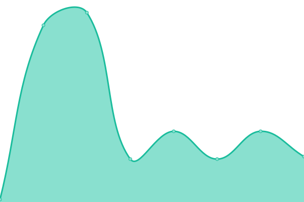
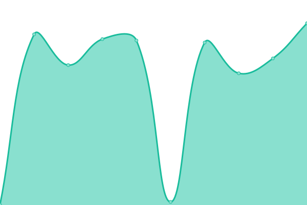

# [📈 Live Status](https://today-mm.github.io/upptime): <!--live status--> **🟧 Partial outage**

This repository contains the open-source uptime monitor and status page for [TODAY](https://today-mm.github.io/upptime), powered by [Upptime](https://github.com/upptime/upptime).

With [Upptime](https://upptime.js.org), you can get your own unlimited and free uptime monitor and status page, powered entirely by a GitHub repository. We use [Issues](https://github.com/today-mm/upptime/issues) as incident reports, [Actions](https://github.com/today-mm/upptime/actions) as uptime monitors, and [Pages](https://today-mm.github.io/upptime) for the status page.

<!--start: status pages-->
<!-- This summary is generated by Upptime (https://github.com/upptime/upptime) -->
<!-- Do not edit this manually, your changes will be overwritten -->
<!-- prettier-ignore -->
| URL | Status | History | Response Time | Uptime |
| --- | ------ | ------- | ------------- | ------ |
|  [2c2p Production](https://pgw.2c2p.com/payment/4.3/initialization) | 🟩 Up | [2c2p-production.yml](https://github.com/today-mm/upptime/commits/HEAD/history/2c2p-production.yml) | 

 902ms
     
 | 

<a href="https://today-mm.github.io/upptime/history/2c2p-production">100.00%</a>
    

|  [2c2p Sandbox](https://sandbox-pgw.2c2p.com/payment/4.3/initialization) | 🟩 Up | [2c2p-sandbox.yml](https://github.com/today-mm/upptime/commits/HEAD/history/2c2p-sandbox.yml) | 

 894ms
     
 | 

<a href="https://today-mm.github.io/upptime/history/2c2p-sandbox">100.00%</a>
    

|  [Wave Money Testing](https://testpayments.wavemoney.io:8107) | 🟥 Down | [wave-money-testing.yml](https://github.com/today-mm/upptime/commits/HEAD/history/wave-money-testing.yml) | 

 48ms
     
 | 

<a href="https://today-mm.github.io/upptime/history/wave-money-testing">0.00%</a>
    

|  [Wave Money UAT](https://uatpayments.wavemoney.io:8107) | 🟥 Down | [wave-money-uat.yml](https://github.com/today-mm/upptime/commits/HEAD/history/wave-money-uat.yml) | 

 0ms
     
 | 

<a href="https://today-mm.github.io/upptime/history/wave-money-uat">0.00%</a>
    

|  [Wave Money Pre Production](https://preprodpayments.wavemoney.io:8107) | 🟩 Up | [wave-money-pre-production.yml](https://github.com/today-mm/upptime/commits/HEAD/history/wave-money-pre-production.yml) | 

 865ms
     
 | 

<a href="https://today-mm.github.io/upptime/history/wave-money-pre-production">96.99%</a>
    

|  [Wave Money Production](https://payments.wavemoney.io) | 🟩 Up | [wave-money-production.yml](https://github.com/today-mm/upptime/commits/HEAD/history/wave-money-production.yml) | 

 770ms
     
 | 

<a href="https://today-mm.github.io/upptime/history/wave-money-production">96.99%</a>
    

|  [TBS Dash](https://dash.todaybooks.com.mm) | 🟩 Up | [tbs-dash.yml](https://github.com/today-mm/upptime/commits/HEAD/history/tbs-dash.yml) | 

 2621ms
     
 | 

<a href="https://today-mm.github.io/upptime/history/tbs-dash">100.00%</a>
    

|  [TBS Site](https://www.todaybooks.com.mm) | 🟥 Down | [tbs-site.yml](https://github.com/today-mm/upptime/commits/HEAD/history/tbs-site.yml) | 

 0ms
     
 | 

<a href="https://today-mm.github.io/upptime/history/tbs-site">0.00%</a>
    

|  [TODAY Note](https://note.todaybooks.com.mm) | 🟥 Down | [today-note.yml](https://github.com/today-mm/upptime/commits/HEAD/history/today-note.yml) | 

 754ms
     
 | 

<a href="https://today-mm.github.io/upptime/history/today-note">0.00%</a>
    

|  [TODAY Myanmar Font Converter](https://mmfontconverter.todaybooks.com.mm) | 🟥 Down | [today-myanmar-font-converter.yml](https://github.com/today-mm/upptime/commits/HEAD/history/today-myanmar-font-converter.yml) | 

 19398ms
     
 | 

<a href="https://today-mm.github.io/upptime/history/today-myanmar-font-converter">0.00%</a>
    

|  [TODAY Syllable](https://mmsyllable.todaybooks.com.mm) | 🟥 Down | [today-syllable.yml](https://github.com/today-mm/upptime/commits/HEAD/history/today-syllable.yml) | 

 19598ms
     
 | 

<a href="https://today-mm.github.io/upptime/history/today-syllable">0.00%</a>
    

<!--end: status pages-->

[**Visit our status website →**](https://today-mm.github.io/upptime)

## 📄 License

- Powered by: [Upptime](https://github.com/upptime/upptime)
- Code: [MIT](./LICENSE) © [TODAY](https://today-mm.github.io/upptime)
- Data in the `./history` directory: [Open Database License](https://opendatacommons.org/licenses/odbl/1-0/)
