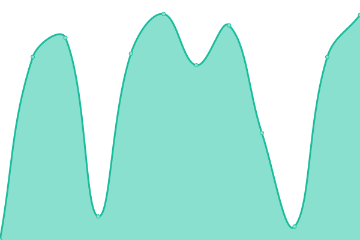

# [

Monitor Services

```
2c2p Production
https://pgw.2c2p.com
2c2p Sandbox
https://sandbox-pgw.2c2p.com
Wave Money Testing
https://testpayments.wavemoney.io:8107
Wave Money UAT
https://uatpayments.wavemoney.io:8107
Wave Money Pre Production
https://preprodpayments.wavemoney.io:8107
Wave Money Production
https://payments.wavemoney.io
TODAY TBD Dash
https://dash.todaybooks.com.mm/
TODAY TBD Site
https://www.todaybooks.com.mm/
TODAY Note
https://note.todaybooks.com.mm/
TODAY Myanmar Font Converter
https://mmfontconverter.todaybooks.com.mm/
TODAY Syllable
https://mmsyllable.todaybooks.com.mm/
```

<!--start: status pages-->
<!-- This summary is generated by Upptime (https://github.com/upptime/upptime) -->
<!-- Do not edit this manually, your changes will be overwritten -->
<!-- prettier-ignore -->
| URL | Status | History | Response Time | Uptime |
| --- | ------ | ------- | ------------- | ------ |
|  [2c2p Production](https://pgw.2c2p.com) | 🟥 Down | [2c2p-production.yml](https://github.com/today-mm/upptime/commits/HEAD/history/2c2p-production.yml) | <details><summary> 761ms</summary><br><a href="https://uppptime.today-mm.js.org/history/2c2p-production"></a><br><a href="https://uppptime.today-mm.js.org/history/2c2p-production"></a><br><a href="https://uppptime.today-mm.js.org/history/2c2p-production"></a><br><a href="https://uppptime.today-mm.js.org/history/2c2p-production"></a><br><a href="https://uppptime.today-mm.js.org/history/2c2p-production"></a></details> | <details><summary><a href="https://uppptime.today-mm.js.org/history/2c2p-production">1.53%</a></summary><a href="https://uppptime.today-mm.js.org/history/2c2p-production"></a><br><a href="https://uppptime.today-mm.js.org/history/2c2p-production"></a><br><a href="https://uppptime.today-mm.js.org/history/2c2p-production"></a><br><a href="https://uppptime.today-mm.js.org/history/2c2p-production"></a><br><a href="https://uppptime.today-mm.js.org/history/2c2p-production"></a></details>
|  [2c2p Sandbox](https://sandbox-pgw.2c2p.com) | 🟥 Down | [2c2p-sandbox.yml](https://github.com/today-mm/upptime/commits/HEAD/history/2c2p-sandbox.yml) | <details><summary> 721ms</summary><br><a href="https://uppptime.today-mm.js.org/history/2c2p-sandbox"></a><br><a href="https://uppptime.today-mm.js.org/history/2c2p-sandbox"></a><br><a href="https://uppptime.today-mm.js.org/history/2c2p-sandbox"></a><br><a href="https://uppptime.today-mm.js.org/history/2c2p-sandbox"></a><br><a href="https://uppptime.today-mm.js.org/history/2c2p-sandbox"></a></details> | <details><summary><a href="https://uppptime.today-mm.js.org/history/2c2p-sandbox">3.37%</a></summary><a href="https://uppptime.today-mm.js.org/history/2c2p-sandbox"></a><br><a href="https://uppptime.today-mm.js.org/history/2c2p-sandbox"></a><br><a href="https://uppptime.today-mm.js.org/history/2c2p-sandbox"></a><br><a href="https://uppptime.today-mm.js.org/history/2c2p-sandbox"></a><br><a href="https://uppptime.today-mm.js.org/history/2c2p-sandbox"></a></details>
|  [Wave Money Testing](https://testpayments.wavemoney.io:8107) | 🟥 Down | [wave-money-testing.yml](https://github.com/today-mm/upptime/commits/HEAD/history/wave-money-testing.yml) | <details><summary> 0ms</summary><br><a href="https://uppptime.today-mm.js.org/history/wave-money-testing"></a><br><a href="https://uppptime.today-mm.js.org/history/wave-money-testing"></a><br><a href="https://uppptime.today-mm.js.org/history/wave-money-testing"></a><br><a href="https://uppptime.today-mm.js.org/history/wave-money-testing"></a><br><a href="https://uppptime.today-mm.js.org/history/wave-money-testing"></a></details> | <details><summary><a href="https://uppptime.today-mm.js.org/history/wave-money-testing">3.19%</a></summary><a href="https://uppptime.today-mm.js.org/history/wave-money-testing"></a><br><a href="https://uppptime.today-mm.js.org/history/wave-money-testing"></a><br><a href="https://uppptime.today-mm.js.org/history/wave-money-testing"></a><br><a href="https://uppptime.today-mm.js.org/history/wave-money-testing"></a><br><a href="https://uppptime.today-mm.js.org/history/wave-money-testing"></a></details>
|  [Wave Money UAT](https://uatpayments.wavemoney.io:8107) | 🟥 Down | [wave-money-uat.yml](https://github.com/today-mm/upptime/commits/HEAD/history/wave-money-uat.yml) | <details><summary> 0ms</summary><br><a href="https://uppptime.today-mm.js.org/history/wave-money-uat"></a><br><a href="https://uppptime.today-mm.js.org/history/wave-money-uat"></a><br><a href="https://uppptime.today-mm.js.org/history/wave-money-uat"></a><br><a href="https://uppptime.today-mm.js.org/history/wave-money-uat"></a><br><a href="https://uppptime.today-mm.js.org/history/wave-money-uat"></a></details> | <details><summary><a href="https://uppptime.today-mm.js.org/history/wave-money-uat">4.71%</a></summary><a href="https://uppptime.today-mm.js.org/history/wave-money-uat"></a><br><a href="https://uppptime.today-mm.js.org/history/wave-money-uat"></a><br><a href="https://uppptime.today-mm.js.org/history/wave-money-uat"></a><br><a href="https://uppptime.today-mm.js.org/history/wave-money-uat"></a><br><a href="https://uppptime.today-mm.js.org/history/wave-money-uat"></a></details>
|  [Wave Money Pre Production](https://preprodpayments.wavemoney.io:8107) | 🟩 Up | [wave-money-pre-production.yml](https://github.com/today-mm/upptime/commits/HEAD/history/wave-money-pre-production.yml) | <details><summary> 891ms</summary><br><a href="https://uppptime.today-mm.js.org/history/wave-money-pre-production"></a><br><a href="https://uppptime.today-mm.js.org/history/wave-money-pre-production"></a><br><a href="https://uppptime.today-mm.js.org/history/wave-money-pre-production"></a><br><a href="https://uppptime.today-mm.js.org/history/wave-money-pre-production"></a><br><a href="https://uppptime.today-mm.js.org/history/wave-money-pre-production"></a></details> | <details><summary><a href="https://uppptime.today-mm.js.org/history/wave-money-pre-production">100.00%</a></summary><a href="https://uppptime.today-mm.js.org/history/wave-money-pre-production"></a><br><a href="https://uppptime.today-mm.js.org/history/wave-money-pre-production"></a><br><a href="https://uppptime.today-mm.js.org/history/wave-money-pre-production"></a><br><a href="https://uppptime.today-mm.js.org/history/wave-money-pre-production"></a><br><a href="https://uppptime.today-mm.js.org/history/wave-money-pre-production"></a></details>
|  [Wave Money Production](https://payments.wavemoney.io) | 🟩 Up | [wave-money-production.yml](https://github.com/today-mm/upptime/commits/HEAD/history/wave-money-production.yml) | <details><summary> 860ms</summary><br><a href="https://uppptime.today-mm.js.org/history/wave-money-production"></a><br><a href="https://uppptime.today-mm.js.org/history/wave-money-production"></a><br><a href="https://uppptime.today-mm.js.org/history/wave-money-production"></a><br><a href="https://uppptime.today-mm.js.org/history/wave-money-production"></a><br><a href="https://uppptime.today-mm.js.org/history/wave-money-production"></a></details> | <details><summary><a href="https://uppptime.today-mm.js.org/history/wave-money-production">100.00%</a></summary><a href="https://uppptime.today-mm.js.org/history/wave-money-production"></a><br><a href="https://uppptime.today-mm.js.org/history/wave-money-production"></a><br><a href="https://uppptime.today-mm.js.org/history/wave-money-production"></a><br><a href="https://uppptime.today-mm.js.org/history/wave-money-production"></a><br><a href="https://uppptime.today-mm.js.org/history/wave-money-production"></a></details>
|  [TODAY TBD Dash](https://dash.todaybooks.com.mm/) | 🟥 Down | [today-tbd-dash.yml](https://github.com/today-mm/upptime/commits/HEAD/history/today-tbd-dash.yml) | <details><summary> 0ms</summary><br><a href="https://uppptime.today-mm.js.org/history/today-tbd-dash"></a><br><a href="https://uppptime.today-mm.js.org/history/today-tbd-dash"></a><br><a href="https://uppptime.today-mm.js.org/history/today-tbd-dash"></a><br><a href="https://uppptime.today-mm.js.org/history/today-tbd-dash"></a><br><a href="https://uppptime.today-mm.js.org/history/today-tbd-dash"></a></details> | <details><summary><a href="https://uppptime.today-mm.js.org/history/today-tbd-dash">10.31%</a></summary><a href="https://uppptime.today-mm.js.org/history/today-tbd-dash"></a><br><a href="https://uppptime.today-mm.js.org/history/today-tbd-dash"></a><br><a href="https://uppptime.today-mm.js.org/history/today-tbd-dash"></a><br><a href="https://uppptime.today-mm.js.org/history/today-tbd-dash"></a><br><a href="https://uppptime.today-mm.js.org/history/today-tbd-dash"></a></details>
|  [TODAY TBD Site](https://www.todaybooks.com.mm/) | 🟩 Up | [today-tbd-site.yml](https://github.com/today-mm/upptime/commits/HEAD/history/today-tbd-site.yml) | <details><summary> 1142ms</summary><br><a href="https://uppptime.today-mm.js.org/history/today-tbd-site"></a><br><a href="https://uppptime.today-mm.js.org/history/today-tbd-site"></a><br><a href="https://uppptime.today-mm.js.org/history/today-tbd-site"></a><br><a href="https://uppptime.today-mm.js.org/history/today-tbd-site"></a><br><a href="https://uppptime.today-mm.js.org/history/today-tbd-site"></a></details> | <details><summary><a href="https://uppptime.today-mm.js.org/history/today-tbd-site">100.00%</a></summary><a href="https://uppptime.today-mm.js.org/history/today-tbd-site"></a><br><a href="https://uppptime.today-mm.js.org/history/today-tbd-site"></a><br><a href="https://uppptime.today-mm.js.org/history/today-tbd-site"></a><br><a href="https://uppptime.today-mm.js.org/history/today-tbd-site"></a><br><a href="https://uppptime.today-mm.js.org/history/today-tbd-site"></a></details>
|  [TODAY Note](https://note.todaybooks.com.mm/) | 🟥 Down | [today-note.yml](https://github.com/today-mm/upptime/commits/HEAD/history/today-note.yml) | <details><summary> 536ms</summary><br><a href="https://uppptime.today-mm.js.org/history/today-note"></a><br><a href="https://uppptime.today-mm.js.org/history/today-note"></a><br><a href="https://uppptime.today-mm.js.org/history/today-note"></a><br><a href="https://uppptime.today-mm.js.org/history/today-note"></a><br><a href="https://uppptime.today-mm.js.org/history/today-note"></a></details> | <details><summary><a href="https://uppptime.today-mm.js.org/history/today-note">4.27%</a></summary><a href="https://uppptime.today-mm.js.org/history/today-note"></a><br><a href="https://uppptime.today-mm.js.org/history/today-note"></a><br><a href="https://uppptime.today-mm.js.org/history/today-note"></a><br><a href="https://uppptime.today-mm.js.org/history/today-note"></a><br><a href="https://uppptime.today-mm.js.org/history/today-note"></a></details>
|  [TODAY Myanmar Font Converter](https://mmfontconverter.todaybooks.com.mm/) | 🟥 Down | [today-myanmar-font-converter.yml](https://github.com/today-mm/upptime/commits/HEAD/history/today-myanmar-font-converter.yml) | <details><summary> 0ms</summary><br><a href="https://uppptime.today-mm.js.org/history/today-myanmar-font-converter"></a><br><a href="https://uppptime.today-mm.js.org/history/today-myanmar-font-converter"></a><br><a href="https://uppptime.today-mm.js.org/history/today-myanmar-font-converter"></a><br><a href="https://uppptime.today-mm.js.org/history/today-myanmar-font-converter"></a><br><a href="https://uppptime.today-mm.js.org/history/today-myanmar-font-converter"></a></details> | <details><summary><a href="https://uppptime.today-mm.js.org/history/today-myanmar-font-converter">8.22%</a></summary><a href="https://uppptime.today-mm.js.org/history/today-myanmar-font-converter"></a><br><a href="https://uppptime.today-mm.js.org/history/today-myanmar-font-converter"></a><br><a href="https://uppptime.today-mm.js.org/history/today-myanmar-font-converter"></a><br><a href="https://uppptime.today-mm.js.org/history/today-myanmar-font-converter"></a><br><a href="https://uppptime.today-mm.js.org/history/today-myanmar-font-converter"></a></details>
|  [TODAY Syllable](https://mmsyllable.todaybooks.com.mm/) | 🟥 Down | [today-syllable.yml](https://github.com/today-mm/upptime/commits/HEAD/history/today-syllable.yml) | <details><summary> 0ms</summary><br><a href="https://uppptime.today-mm.js.org/history/today-syllable"></a><br><a href="https://uppptime.today-mm.js.org/history/today-syllable"></a><br><a href="https://uppptime.today-mm.js.org/history/today-syllable"></a><br><a href="https://uppptime.today-mm.js.org/history/today-syllable"></a><br><a href="https://uppptime.today-mm.js.org/history/today-syllable"></a></details> | <details><summary><a href="https://uppptime.today-mm.js.org/history/today-syllable">16.86%</a></summary><a href="https://uppptime.today-mm.js.org/history/today-syllable"></a><br><a href="https://uppptime.today-mm.js.org/history/today-syllable"></a><br><a href="https://uppptime.today-mm.js.org/history/today-syllable"></a><br><a href="https://uppptime.today-mm.js.org/history/today-syllable"></a><br><a href="https://uppptime.today-mm.js.org/history/today-syllable"></a></details>

<!--end: status pages-->

## ⭐ How it works

- GitHub Actions is used as an uptime monitor
  - Every 5 minutes, a workflow visits your website to make sure it's up
  - Response time is recorded every 6 hours and committed to git
  - Graphs of response time are generated every day
- GitHub Issues is used for incident reports
  - An issue is opened if an endpoint is down
  - People from your team are assigned to the issue
  - Incidents reports are posted as issue comments
  - Issues are locked so non-members cannot comment on them
  - Issues are closed automatically when your site comes back up
  - Slack notifications are sent on updates
- GitHub Pages is used for the status website
  - A simple, beautiful, and accessible PWA is generated
  - Built with Svelte and Sapper
  - Fetches data from this repository using the GitHub API
